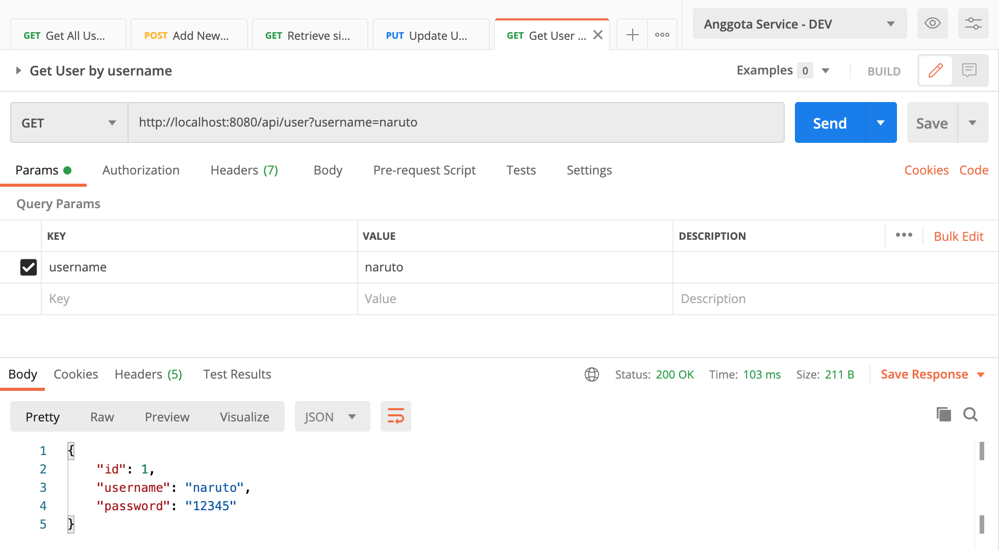

# springboot-rest-error-handling-sample
### Things todo list:
1. Clone this repository: `git clone https://github.com/hendisantika/springboot-rest-error-handling-sample.git`
2. Go inside the folder: `cd springboot-rest-error-handling-sample`
3. Run the application: `mvn clean spring-boot:run`
4. Open your favorite browser: http://localhost:8080

#### The following, are our API’s endpoints:

`GET /api/users` to get all Users

`GET /api/users/{id}` to retrieve single User by ID

`POST /api/users` to create new User

`PUT /api/users/{id}` to update User details

`DELETE /api/users/{id}` to delete User by ID

`GET /api/user?username={username}` to get User by username - this endpoint has no real value for our REST API, it is created just for testing purpose!

### Images Screen shot

List All Users

Add New User

Find a User

Find a user by username

Update a user

Delete user

Constraint Violations

Invalid JSON

Malformed JSOn Request

Method Not Found

Mismatch Type

Missing Parameter

Resource Not Found

Validation Error

